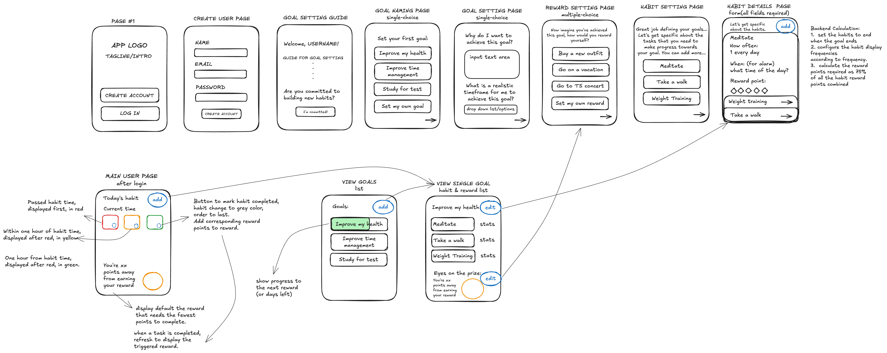

# Project Title
S3NSYN

## Overview
S3NSYN is an intuitive habit-tracking app designed to help users cultivate meaningful routines and achieve personal milestones. With S3NSYN, users can set goals, track daily habits, and monitor their progress over time.

### Problem Space

S3NSYN addresses several challenges I face in managing my daily routine. Current calendar apps lack the functionality to display and mark completed tasks, making it difficult to remember to complete the tasks or track progress. I also find myself wasting time on my phone without purpose, as there’s no curated library of activities to guide me based on my goals. Lastly, there’s a need for a rewarding system to motivate habit-building, which is why I want to incorporate gamification to encourage consistent progress.

### User Profile

Goal setters and habit builders:
  - Looking for a way to track and organize their daily habits and goals.
  - Want to monitor progress over time to stay motivated.
  - Looking for a system to remind them of tasks and help them stay on track.
  - Interested in a reward system that encourages consistency and celebrates achievements.
  - Want personalized suggestions for activities aligned with their goals to reduce time wasted on distractions.

### Features

- User Account Management:
  - Create Account: Users can create an account to set up goals and actions.
  - Login/Logout: Users can log in to access and manage their goals and actions.

- Goal and Action Setup:
  - Create Goals: Logged-in users can create up to 3 goals.
  - Set Actions for Goals: Users can define specific actions required to achieve each goal.
  - Action Scheduling: Users can set how often and when each action should be completed (e.g., daily, weekly, at specific times).

- Task Reminders and Action Tracking:
  -  Time-Based Reminders: Users are reminded of the actions they need to complete based on the time of day (e.g., morning, afternoon, evening).
  - Mark Actions as Completed: Users can mark actions as completed once they’ve been finished, contributing to their goal progress.

- Rewards and Progress Tracking:
  - Set Up Rewards: Users can configure rewards that will be unlocked as they accumulate completed actions (e.g., points or milestones).
  - Reward Increment: Users can see their reward progress increase as they complete actions and accumulate reward points.

## Implementation

### Tech Stack

- React
- MySQL
- Express
- Client libraries: 
  - react
  - react-router
  - axios
- Server libraries:
  - knex
  - express
  - bcrypt for password hashing

### APIs
- No external APIs will be used for the first sprint 

### Sitemap

### Mockups

### Data
- Relational Diagram: 
    - Users → Goals: One user can have multiple goals.
    - Goals → Habits: Each goal consists of multiple habits.
    - Users → Rewards: Users have multiple rewards associated with their accounts.
    - Habits → Reminders: Each habit can have multiple reminders (optional).

### Endpoints

**POST /api/auth/register**
- Register a New User
Request Body:
{
  "name": "John Doe",
  "email": "john.doe@example.com",
  "password": "password123"
}
Response:
{
  "message": "User registered successfully",
  "userId": "user_123"
}

**POST /api/auth/login**
- Login User
Request Body:
{
  "email": "john.doe@example.com",
  "password": "password123"
}
Response:
{
  "userId": "user_123"
}

**GET /api/goals**
- Get User Goals
Response:
{
  "goals": [
    {
      "id": "goal_1",
      "title": "Improve my health",
      "description": "Stay fit by exercising regularly",
      "reward": "Go on a vacation",
      "progress": "50%"
    }
  ]
}

**POST /api/goals**
- Create a Goal
Request Body:
{
  "title": "Improve my health",
  "description": "Stay fit by exercising regularly",
  "reward": "Go on a vacation",
  "targetCompletionDate": "2024-12-31"
}
Response:
{
  "message": "Goal created successfully",
  "goalId": "goal_1"
}

**PUT /api/goals/:goalId**
- Update a Goal
Request Body:
{
  "title": "Improve my health",
  "description": "Updated description",
  "reward": "Buy new clothes"
  "targetCompletionDate": "2024-12-31"
}
Response:
{
  "message": "Goal updated successfully"
}

**DELETE /api/goals/:goalId**
- Delete a Goal
Response:
{
  "message": "Goal deleted successfully"
}

**GET /api/goals/:goalId/habits**
- Get Habits for a Goal
Response:
{
  "habits": [
    {
      "id": "habit_1",
      "title": "Meditate",
      "frequency": "daily",
      "timeOfDay": "08:00 AM",
      "rewardPoints": 10,
      "lastCompleted": "2024-11-16"
    }
  ]
}

**POST /api/goals/:goalId/habits**
- Create a Habit
Request Body:
{
  "title": "Meditate",
  "frequency": "daily",
  "timeOfDay": "08:00 AM",
  "rewardPoints": 10
}
Response:
{
  "message": "Habit created successfully",
  "habitId": "habit_1"
}

**PUT /api/habits/:habitId**
- Update a Habit
Request Body:
{
  "title": "Meditate every morning",
  "frequency": "daily",
  "timeOfDay": "07:00 AM"
}
Response:
{
  "message": "Habit updated successfully"
}

**POST /api/habits/:habitId/complete**
- Mark Habit as Completed
Response:
{
  "message": "Habit marked as complete",
  "updatedRewardPoints": 40
}

**DELETE /api/habits/:habitId**
- Delete a Habit
Response:
{
  "message": "Habit deleted successfully"
}

**GET /api/rewards**
- Get Rewards
Response:
{
  "rewards": [
    {
      "id": "reward_1",
      "description": "Go on a vacation",
      "pointsRequired": 100,
      "progress": "40%"
    }
  ]
}

**POST /api/rewards**
- Create a Reward
Request Body:
{
  "description": "Buy a new outfit",
  "pointsRequired": 50
}
Response:
{
  "message": "Reward created successfully",
  "rewardId": "reward_2"
}

**POST /api/rewards/:rewardId/claim**
- Claim a Reward
Response:
{
  "message": "Reward claimed successfully"
}

**GET /api/habits/today**
- Get Today's Habits
Response:
{
  "habits": [
    {
      "id": "habit_1",
      "title": "Meditate",
      "timeOfDay": "08:00 AM",
      "status": "due"
    }
  ]
}

## Roadmap

1. Project Setup
  - Set up the project structure for both frontend and backend.
  - Configure the database, environment variables, and dependencies.

2. User Authentication
  - Backend: Implement user registration, login, and JWT-based authentication.
  - Frontend: Build pages for user signup and login, with form validation and API integration.

3. Goal Management
  - Backend: Create CRUD endpoints for goals (e.g., adding, updating, and deleting goals).
  - Frontend: Design interfaces for creating, viewing, and managing goals.

4. Habit Management
  - Backend: Develop endpoints for habit creation, editing, and frequency tracking.
  - Frontend: Build the UI for tracking habits, adding new ones, and marking them as completed.

5. Reward System
  - Backend: Implement logic for reward creation, tracking, and goal-based accumulation.
  - Frontend: Add features for users to view and set up rewards and track progress towards earning them.

6. Notifications and Daily Dashboard
  - Backend: Create logic to fetch and update habits based on frequency (e.g., daily, weekly, monthly).
  - Frontend: Design a dashboard to display today's habits, time-based reminders, and user progress.

7. Testing, Optimization, and Deployment
  - Test API endpoints, database queries, and frontend components for errors and usability.
  - Optimize the user interface and fix any remaining bugs.
  - Deploy the app 

## Future Implementations

- add goal completion page (with confetti animations)
- repeat completed goals
- have a libray of suggested habits
- connect AI to write cusomized motivations
- send users emails
- connect with IOS health data
- connect with device calendar
- allow notifications on phone